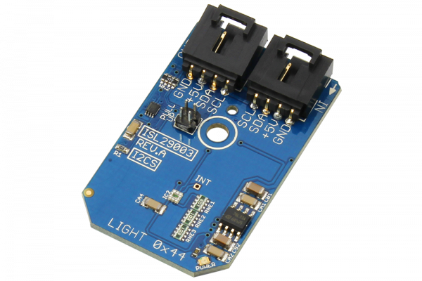

[](https://store.ncd.io/product/isl29003-light-sensor-with-programmable-gain-0-64000-lux-16-bit-i2c-mini-module/).

# ISL29003

The ISL29003 is a light sensor with an internal analog-to-digital converter (ADC) that provides 16-bit resolution while rejecting 50Hz and 60Hz flicker caused by artificial light sources.This device offers user-programmable gain from 0-64,000 lux.The ISL29003 also offers a power-down mode.
This Device is available from www.ncd.io

[SKU: ISL29003]

(https://store.ncd.io/product/isl29003-light-sensor-with-programmable-gain-0-64000-lux-16-bit-i2c-mini-module/)
This Sample code can be used with Raspberry Pi.

Hardware needed to interface ISL29003 light sensor With Raspberry Pi :

1. <a href="https://store.ncd.io/product/isl29003-light-sensor-with-programmable-gain-0-64000-lux-16-bit-i2c-mini-module/">ISL29003 16Bit light Sensor</a>

2. <a href="https://store.ncd.io/product/i2c-shield-for-raspberry-pi-3-pi2-with-outward-facing-i2c-port-terminates-over-hdmi-port/">Raspberry Pi I2C Shield</a>

3. <a href="https://store.ncd.io/product/i%C2%B2c-cable/">I2C Cable</a>

## Python

Download and install smbus library on Raspberry pi. Steps to install smbus are provided at:

https://pypi.python.org/pypi/smbus-cffi/0.5.1

Download (or git pull) the code in pi. Run the program.

```cpp
$> python ISL29003.py
```
The lib is a sample library, you will need to calibrate the sensor according to your application requirement.
